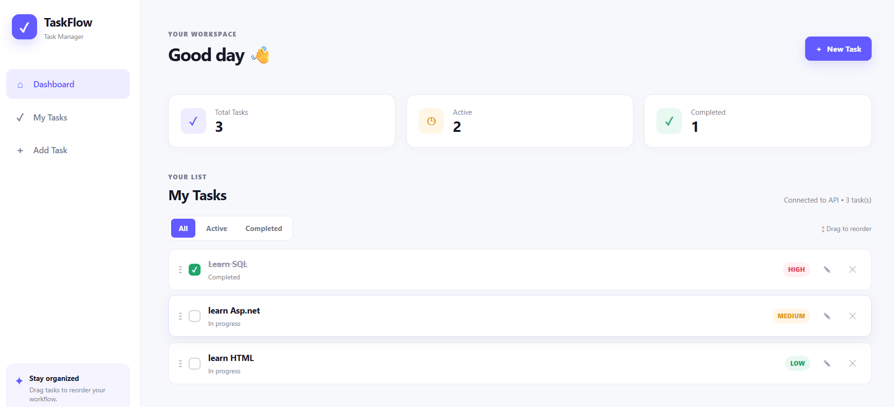
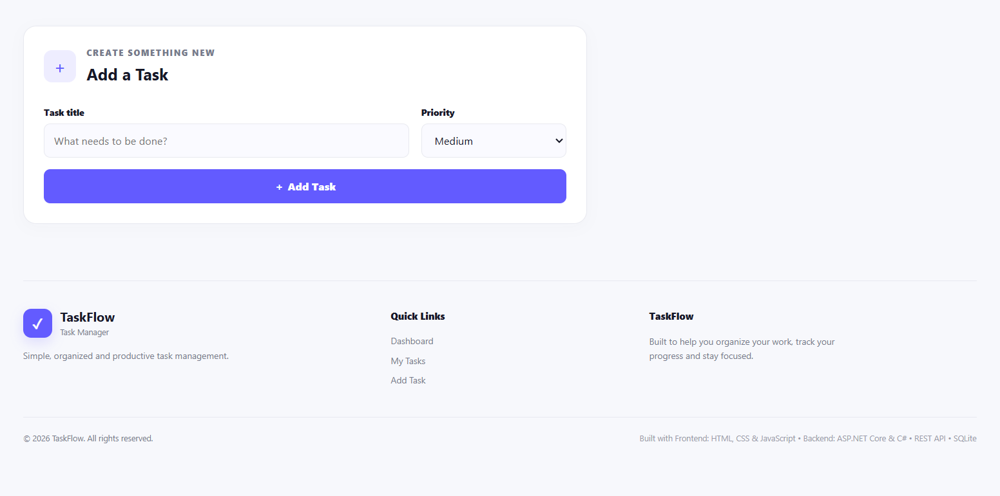
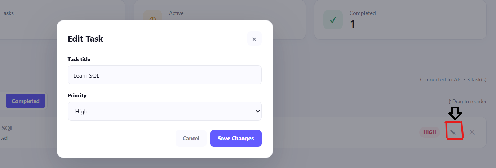
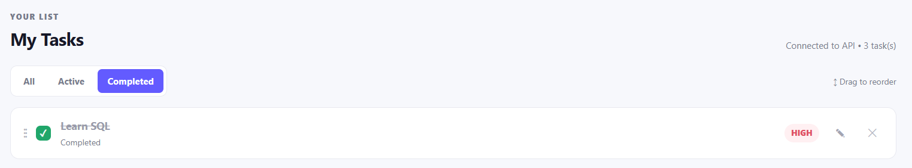
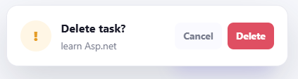
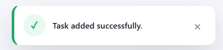
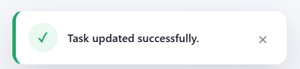
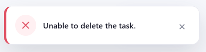
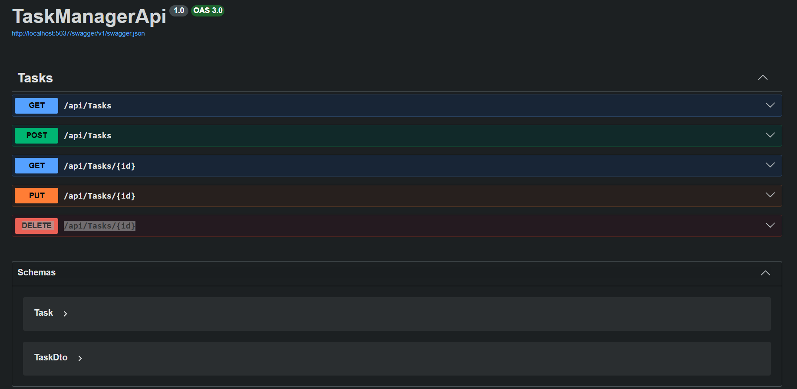

# TaskFlow — Task Management System

TaskFlow is a modern and responsive full-stack task management application.

The project consists of a frontend built with **HTML5, CSS3, and JavaScript**, and a backend built with **ASP.NET Core Web API, C#, Entity Framework Core, and SQLite**.

The application allows users to create, view, update, complete, filter, and delete tasks through a simple and organized interface.

---

## Project Structure

```text
TaskManager-Final/
│
├── backend/
│   │
│   ├── Controllers/
│   │   └── TasksController.cs
│   │
│   ├── Data/
│   │   └── AppDbContext.cs
│   │
│   ├── Dtos/
│   │   └── TaskDto.cs
│   │
│   ├── Models/
│   │   └── Task.cs
│   │
│   ├── Migrations/
│   │
│   ├── Properties/
│   │
│   ├── appsettings.json
│   ├── Program.cs
│   ├── requests.http
│   ├── TaskManagerApi.csproj
│   └── README.md
│
├── frontend/
│   │
│   ├── index.html
│   ├── styles.css
│   ├── app.js
│   └── README.md
│
├── screenshots/
│   ├── dashboard.png
│   ├── add-task.png
│   ├── edit-task.png
│   ├── completed-tasks.png
│   ├── toast-success.png
│   ├── toast-update.png
│   ├── toast-error.png
│   ├── toast-delete.png
│   └── swagger.png
│
└── README.md
```

---

# Technologies Used

## Frontend

* HTML5
* CSS3
* JavaScript
* Fetch API
* DOM Manipulation
* Responsive Design

## Backend

* C#
* ASP.NET Core Web API
* Entity Framework Core
* SQLite
* REST API
* Swagger / OpenAPI
* CORS

---

# Features

## Dashboard

The dashboard provides an overview of the tasks and displays:

* Total Tasks
* Active Tasks
* Completed Tasks

The statistics are updated dynamically according to the tasks stored in the database.



---

## Add Task

Users can create a new task by entering:

* Task title
* Priority

Available priority levels:

* Low
* Medium
* High

The task is sent to the backend using a `POST` request and stored in the SQLite database.



---

## View Tasks

All tasks are retrieved from the backend using:

```http
GET /api/Tasks
```

The tasks are displayed dynamically in the TaskFlow interface.

---

## Edit / Update Task

Users can update a task and change its information.

The frontend communicates with the backend using:

```http
PUT /api/Tasks/{id}
```

The update operation keeps the frontend and database synchronized.



---

## Complete / Uncomplete Task

Users can mark a task as completed by clicking the checkbox.

Completed tasks can also be returned to the active state.

This operation uses the backend `PUT` endpoint.



---

# Task Filters

TaskFlow provides three filters:

* **All** — displays all tasks
* **Active** — displays unfinished tasks
* **Completed** — displays completed tasks

Filtering is handled dynamically using JavaScript.

---

# Delete Task

Users can delete tasks from the task list.

Before deleting a task, TaskFlow displays a confirmation toast.

After confirmation, the frontend sends:

```http
DELETE /api/Tasks/{id}
```

The task is then removed from the database.



---

# Toast Notifications

TaskFlow includes a custom toast notification system to provide feedback to the user.

The application displays toast messages for different operations.

## Success Toast

A success toast is displayed when an operation is completed successfully.



---

## Update Toast

An update toast is displayed after successfully updating a task.



---

## Error Toast

An error toast is displayed when an operation fails or when the frontend cannot communicate successfully with the backend API.



---

## Delete Confirmation Toast

Before deleting a task, the user receives a confirmation toast with options to continue or cancel.


---

# Drag and Drop

TaskFlow supports drag-and-drop interaction for reordering tasks in the task list.

The interface provides a drag handle to make task reordering easier.

---

# Responsive Design

The frontend is designed to work across different screen sizes:

* Desktop
* Tablet
* Mobile
* Small mobile screens

Responsive CSS media queries are used to adapt the layout and components.

---

# Backend API

The backend is an ASP.NET Core Web API that provides RESTful endpoints for managing tasks.

## API Endpoints

| Method | Endpoint          | Description       |
| ------ | ----------------- | ----------------- |
| GET    | `/api/Tasks`      | Get all tasks     |
| GET    | `/api/Tasks/{id}` | Get a task by ID  |
| POST   | `/api/Tasks`      | Create a new task |
| PUT    | `/api/Tasks/{id}` | Update a task     |
| DELETE | `/api/Tasks/{id}` | Delete a task     |

---

# Task Model

Each task contains the following properties:

```text
Id
Title
Priority
IsDone
```

Example:

```json
{
  "id": 1,
  "title": "Complete TaskFlow project",
  "priority": "High",
  "isDone": false
}
```

---

# API Operations

## GET — Get All Tasks

```http
GET /api/Tasks
```

Returns all tasks stored in the database.

---

## GET — Get Task By ID

```http
GET /api/Tasks/{id}
```

Example:

```http
GET /api/Tasks/1
```

Returns a specific task.

---

## POST — Create Task

```http
POST /api/Tasks
```

Example request:

```json
{
  "title": "Learn ASP.NET Core",
  "priority": "High",
  "isDone": false
}
```

---

## PUT — Update Task

```http
PUT /api/Tasks/{id}
```

Example:

```json
{
  "title": "Learn ASP.NET Core",
  "priority": "High",
  "isDone": true
}
```

The `PUT` operation is used to update task information and to change the completion status.

---

## DELETE — Delete Task

```http
DELETE /api/Tasks/{id}
```

Example:

```http
DELETE /api/Tasks/1
```

Deletes the selected task.

---

# Database

TaskFlow uses **SQLite** as its database.

Entity Framework Core is used as the ORM to communicate with the database.

The database context is:

```text
AppDbContext
```

The task data is stored in the `Tasks` table.

---

# CORS

The backend includes a CORS policy named:

```text
AllowFrontend
```

The policy allows the frontend to communicate with the ASP.NET Core API.

It allows:

* Any origin
* Any HTTP method
* Any HTTP header

---

# Error Handling

The backend includes exception handling for:

* Database errors
* Invalid database operations
* General exceptions

The API returns appropriate HTTP status codes, including:

```text
200 OK
201 Created
204 No Content
404 Not Found
500 Internal Server Error
```

The frontend also displays an **Error Toast** when an API operation fails.

---

# Frontend ↔ Backend Communication

The frontend communicates with the backend through REST API requests using JavaScript `fetch()`.

The API base URL is:

```javascript
const API_BASE = "http://localhost:5037/api/Tasks";
```

The communication flow is:

```text
User
  │
  ▼
TaskFlow Frontend
  │
  ▼
JavaScript Fetch API
  │
  ▼
ASP.NET Core Web API
  │
  ▼
TasksController
  │
  ▼
Entity Framework Core
  │
  ▼
SQLite Database
```

---

# Swagger / OpenAPI

Swagger is included in the backend for API documentation and testing.

After starting the backend, open:

```text
http://localhost:5037/swagger
```

Swagger allows developers to test the available API endpoints directly from the browser.



---

# Running the Project

## 1. Run the Backend

Open a terminal inside the `backend` folder:

```bash
dotnet restore
```

Then run:

```bash
dotnet run
```

The API will be available at:

```text
http://localhost:5037
```

---

## 2. Open Swagger

After starting the backend, open:

```text
http://localhost:5037/swagger
```

Verify that the API endpoints are available.

---

## 3. Run the Frontend

Open the `frontend` folder.

Run `index.html` using a local development server such as **VS Code Live Server**.

The frontend will communicate with:

```text
http://localhost:5037/api/Tasks
```

---

# API Testing

The backend includes a:

```text
requests.http
```

file.

It can be used to test the API endpoints directly.

Example:

```http
GET http://localhost:5037/api/Tasks
```

Other requests include:

```http
POST http://localhost:5037/api/Tasks
```

```http
PUT http://localhost:5037/api/Tasks/1
```

```http
DELETE http://localhost:5037/api/Tasks/1
```

---

# Screenshots

The project includes screenshots demonstrating the main features and interface.

All screenshots are stored inside:

```text
screenshots/
```

## Dashboard


---

## Add Task


---

## Edit / Update Task


---

## Completed Tasks


---

## Success Toast


---

## Update Toast


---

## Error Toast


---

## Delete Confirmation


---

## Swagger API


---

# Project Architecture

```text
                         TaskFlow
                            │
             ┌──────────────┴──────────────┐
             │                             │
             ▼                             ▼
         Frontend                       Backend
             │                             │
     HTML + CSS + JS                ASP.NET Core
             │                         C# Web API
             │                             │
             │                         REST API
             │                             │
             └──────── HTTP ───────────────┘
                                           │
                                           ▼
                                  Entity Framework Core
                                           │
                                           ▼
                                         SQLite
```

---

# Project Purpose

TaskFlow was developed as a full-stack web application to demonstrate practical skills in:

* Frontend development
* Responsive web design
* JavaScript programming
* DOM manipulation
* REST API integration
* CRUD operations
* ASP.NET Core Web API
* C#
* Entity Framework Core
* SQLite
* API testing
* Error handling
* Frontend and backend integration

---

# Technologies Summary

```text
Frontend
HTML5
CSS3
JavaScript

        │
        │ REST API
        ▼

Backend
ASP.NET Core Web API
C#

        │
        ▼

Entity Framework Core

        │
        ▼

SQLite
```

---

# Author

**Rahaf Abumelish**  
Software Engineer | Full-Stack Web Developer

# TaskFlow — Task Management System

Full-Stack Web Application

*Frontend: HTML5, CSS3, JavaScript
*Backend: ASP.NET Core Web API & C#
*Database:*SQLite
*ORM: Entity Framework Core
*API Documentation: Swagger / OpenAPI
